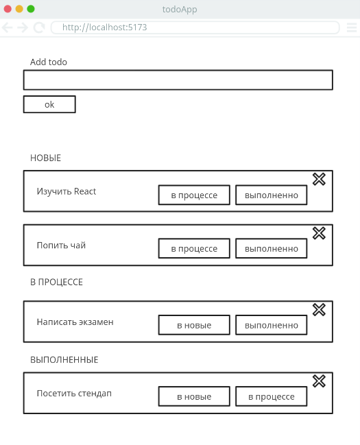

# Task manager

## Введение
Тебе предстоит создать приложение для учета задач. Приложение должно позволять добавлять, удалять и редактировать задачи.
Только зарегистрированные пользователи могут добавлять задачи. Для регистрации пользователь должен указать имя email и пароль.
Каждая задача имеет описание и три статуса: "новая", "в работе" и "завершена". Пользователь может поменять статус задачи.

### Рекомендации

1. Прочитай всё задание целиком.

2. Сфокусируйся на функционале приложения, оценивать будем в первую очередь его.

   Красивая вёрстка — это приятно, но может затратить слишком много времени.

## Release 0. Подготовка к работе

Проверь, что есть в проекте. Проверь содержимое package.json, .gitignore и остальных файлов. Дополни при необходимости. Установи зависимости, которые будешь использовать в работе.

Подумай, из каких частей будет состоять твоё приложение, спроектируй базу данных.

## Release 1. Модели и миграции

Создай модели и миграции для пользователей и задач.
Продумай связь между моделями. Например, у пользователя может быть много задач, а у задачи может быть только один пользователь.

Как будет выглядеть поле статуса задачи в базе данных? Какие значения оно может принимать? Будет ли это поле строковым или числовым?
ВАЖНО! Задачи могут быть трех типов: "новая", "в работе" и "завершена".

## Release 2: Главная страница

Если пользователь не аутентифицирован, он увидит пустую страницу с кнопкой "Войти". При нажатии на кнопку он попадет на страницу аутентификации.
Подумай, как переходить на страницу аутентификации, без перезагрузки страницы (мягкий переход).

## Release 3. Регистрация

Создай страницу регистрации с необходимыми полями:

- Email
- Имя
- Пароль

## Release 4. Вход

Создайте страницу входа с необходимыми полями:

- Email
- Пароль

## Release 5. Выход

Пользователь должен иметь возможность выйти из системы. Создайте кнопку выхода из системы в меню навигации.

## Release 6. Главная страница после аутентификации

После того как пользователь вошел в систему, он попадает на главную страницу.
Ему становится доступна форма для добавления задачи. Под формой должен быть список задач. Задачи отображаются по категориям: "новые", "в работе", "завершенные". Пользователь может поменять статус задачи. После изменения статуса задача должна переместиться в соответствующую категорию.

Примерный вид главной страницы:

## Release 7. Редактирование задачи

Рализуй функционал полного редактирования задачи. Пользователь может изменить описание задачи и её статус. Редактирование может быть выполнено как в модальном окне так и на отдельной странице.

## Release 8. Данные для демонстрации

Нет seeder-файла? Самое время его написать. Заполни базу данных тестовыми данными. Например, создай 3 пользователя и по 3 задачи для каждого пользователя с разными статусами.